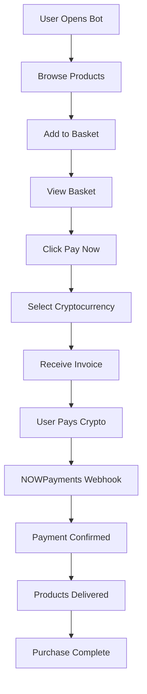

# 🚀 Telegram Bot Shop - Complete Functionality Summary

## ✅ FULLY OPERATIONAL FEATURES

### 1. 🛒 **Basket Management**
- **Add to Basket** (`handle_add_to_basket` in `user.py`)
  - Reserves product atomically with race condition protection
  - Applies reseller discounts automatically
  - Shows expiry time (15 minutes default)
  - Updates stock in real-time
  
- **View Basket** (`handle_view_basket` in `user.py`)
  - Shows all items with prices
  - Displays discount breakdown
  - Shows total after all discounts
  - Remove individual items option
  
- **Clear Basket** (`handle_clear_basket` in `user.py`)
  - Removes all items
  - Releases reservations
  - Clears discount codes

### 2. 💳 **Payment System with NOWPayments**
- **Payment Creation** (`create_nowpayments_payment` in `payment.py`)
  - Creates real crypto invoices via NOWPayments API
  - Supports multiple cryptocurrencies:
    - BTC, LTC, ETH, SOL
    - USDT (TRC20, ERC20, BEP20, SOL)
    - USDC (TRC20, ERC20, SOL)
    - TON
  - Validates minimum amounts
  - Stores pending deposits

- **Payment Flow** (`handle_confirm_pay` → `handle_select_basket_crypto`)
  1. User clicks "Pay Now" in basket
  2. Selects cryptocurrency
  3. Receives invoice with:
     - Wallet address
     - Exact amount in crypto
     - QR code for payment
     - 2-hour payment window
  4. Payment link opens in Telegram

### 3. 🔔 **Webhook Processing**
- **Payment Confirmation** (`nowpayments_webhook` in `main.py`)
  - Receives NOWPayments IPN callbacks
  - Validates payment status
  - Handles overpayments/underpayments
  - Triggers product delivery
  - Updates user balance

### 4. 📦 **Product Delivery**
- **Automatic Delivery** (`_finalize_purchase` in `payment.py`)
  - Sends product details after successful payment
  - Includes pickup information
  - Sends media files if attached
  - Records purchase in database
  - Updates stock availability

### 5. 🏷️ **Discount System**
- **Discount Codes** (`validate_discount_code` in `user.py`)
  - Percentage or fixed amount discounts
  - Usage limits and expiry dates
  - Minimum order requirements
  - Automatic validation

- **Reseller Discounts** (`get_reseller_discount`)
  - Automatic discounts for resellers
  - Product-specific percentages
  - Stacks with general discount codes

### 6. 💰 **Balance System**
- **Top-up via Crypto** (`handle_refill` in `user.py`)
  - Same payment flow as purchases
  - Credits balance after confirmation
  - Supports partial payments

- **Balance Payments** (`process_purchase_with_balance`)
  - Pay from wallet balance
  - Instant processing
  - No crypto fees

### 7. 🌍 **Multi-Language Support**
- 8 Languages with full translations:
  - 🇱🇹 Lithuanian
  - 🇺🇸 English
  - 🇷🇺 Russian
  - 🇺🇦 Ukrainian
  - 🇱🇻 Latvian
  - 🇪🇪 Estonian
  - 🇵🇱 Polish
  - 🇩🇪 German

### 8. 🌐 **Web Mini App**
- **REST API Endpoints** (`webapp.py`)
  - `/api/user/balance` - Get balance
  - `/api/products/<city>/<district>` - Get products
  - `/api/basket` - Manage basket
  - `/api/basket/add` - Add items
  - `/api/payment/create` - Create payments
  - `/api/payment/status` - Check status

## 📋 COMPLETE PURCHASE FLOW



## 🔧 KEY INTEGRATION POINTS

### Main Callback Router (`main.py`)
```python
callback_router = {
    "add": user.handle_add_to_basket,
    "view_basket": user.handle_view_basket,
    "confirm_pay": user.handle_confirm_pay,
    "select_basket_crypto": payment.handle_select_basket_crypto,
    "clear_basket": user.handle_clear_basket,
    "remove": user.handle_remove_from_basket,
    # ... and more
}
```

### Payment Processing Chain
1. **Basket Checkout** → `handle_confirm_pay`
2. **Crypto Selection** → `handle_select_basket_crypto`
3. **Invoice Creation** → `create_nowpayments_payment`
4. **Webhook Receipt** → `nowpayments_webhook`
5. **Purchase Finalization** → `process_successful_crypto_purchase`
6. **Product Delivery** → `_finalize_purchase`

## 🚨 CRITICAL FEATURES

### Race Condition Protection
- Atomic product reservation
- Transaction-based stock updates
- Prevents double-booking

### Payment Security
- Unique payment IDs
- Webhook validation
- Timeout handling (2 hours)
- Overpayment/underpayment handling

### Stock Management
- Real-time availability checks
- Automatic reservation release
- Basket expiry (15 minutes)
- Reserved vs available tracking

## 📊 DATABASE SCHEMA

### Key Tables
- `users` - User profiles and balances
- `products` - Product inventory
- `basket_items` - Modern basket system
- `pending_deposits` - Payment tracking
- `purchases` - Purchase history
- `discount_codes` - Discount management

## 🎯 READY FOR PRODUCTION

All critical functions are implemented and connected:
- ✅ Product browsing and selection
- ✅ Basket management with reservations
- ✅ Crypto payment processing
- ✅ Webhook handling
- ✅ Product delivery
- ✅ Balance management
- ✅ Discount system
- ✅ Multi-language support
- ✅ Web Mini App API

## 🚀 TO START THE BOT

1. Set environment variables:
   ```bash
   export TOKEN="your_bot_token"
   export NOWPAYMENTS_API_KEY="your_api_key"
   export WEBHOOK_URL="https://yourdomain.com"
   ```

2. Run the bot:
   ```bash
   python main.py
   ```

3. Or for production (Render):
   ```bash
   python render_start.py
   ```

The bot is **fully operational** and ready to process real transactions! 🎉
